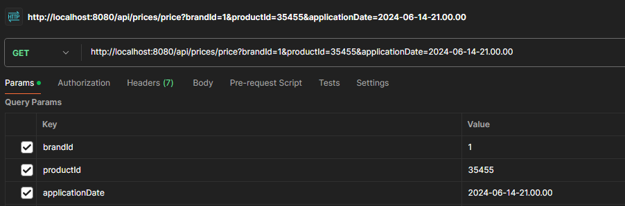

# Guia de Uso API-CLIENTEZA Tarifas Precios Productos

Esta API permite consultar el precio aplicable de un producto específico en una cadena de tiendas, basado en la fecha de consulta, el identificador del producto y el identificador de la cadena, de modo que si dos tarifas coinciden en un rago de fechas se aplica la de mayor prioridad (mayor valor numérico).

## Tabla de contenidos
- [Configuración](#configuracion)
- [URLs](#urls)
    - [URL base](#url-base)
    - [URL servicio REST ClienteZA](#url-servicio-rest-clienteza)
    - [URL h2-console](#URL-h2-console)
- [Endpoints](#endpoints)
    - [`GET /allprices`](#get-allprices)
    - [`GET /price`](#get-price)
- [Respuestas](#respuestas)
    - [Respuesta EXITOSA](#respuesta-exitosa)
    - [Respuesta ERROR](#respuestas-error)
- [Pruebas POSTMAN](#pruebas-postman)
- [Testing](#testing)

---

## Configuración

El proyecto se encuentra alojado en GitHub en el repositorio <a href="https://github.com/abeneitezm_indra/clienteZA"><b>ClienteZA</b></a>. Seguir los siguiente pasos para su descarga y arrancar el servicio:

1. Entrar en la URL [https://github.com/abeneitezm_indra/clienteZA](https://github.com/abeneitezm_indra/clienteZA) y descargar el fichero zip del proyecto o bien ejecutar en el equpipo local por línea de comandos donde se desee intalar la aplicación el siguiente comando:
    ```bash
    git clone https://github.com/abeneitezm_indra/clienteZA
    ```
2. Una vez descargado el fichero descomprimirlo en una carpeta local.
3. Abrir un IDE como VSCode, Eclipse o IntelliJ y abrir el proyecto descomprimido.
4. Las opciones para arrancar el servicio son las siguientes: 

    4.1 En la mayoría de IDEs se puede arrancar el proyecto Spring Boot localizando el paquete `com.prueba.cliente.clienteza` donde se ubica la clase `@SpringBootApplication` y con el botón derecho del ratón seleccionar la opción `"Run as"` y pulsar `"Spring Boot Application"`.
 
    4.2 También se puede arrancar desde línea de comandos ejecutando los siguientes comandos:

    ```bash
    mvn clean install  // limpiar y compilar el proyecto generado los class
    mvn package // empaquetar y generar el jar
    java -jar clienteZA-0.0.1-SNAPSHOT.jar -Dserver.port=8080 // arrancar proyecto
    ```

    4.3 Si nos vamos a la clase `@SpringBootApplication` del paquete `com.prueba.cliente.clienteza`, vemos que sobre el método `main` aparece la opción <i>`"Run"`</i>, pulsar y se arrancará el servicio:

    

> <i>NOTA: para ejecutar los comando "java" y "mvn" se debe tener instalados y configurados JavaSE y Maven de forma adecuada en el equipo local donde se vaya a probar la aplicación.</i>

## URLs

### URL base
Si se arranca el proyecto en un equipo local, por defecto al arrancar el servicio la **URL base** donde se despliega el servicio será:

> http://localhost:8080/

### URL servicio REST ClienteZA

La URL configurada para el servicio **REST** de la aplicación **ClienteZA** es la siguiente:

> http://localhost:8080/api/prices

### URL h2-console

La consola Hibernate para el acceso a la base de datos h2 se ha configurado para la siguiente URL:

> http://localhost:8080/h2-console

Está configurada para las credenciales de acceso `user = sa`  y **no tiene password**. Se precarga dicha base de datos con los datos de los cuatro precios indicados en los requisitos.

## Endpoints

### GET `/allprices`

Devuelve todos los precios y productos registrados en la bbdd.

> Parámetros de entrada

<b>No requeridos</b>

> Ejemplo de solicitud

Método <b>GET</b> invocando a: `http://localhost:8080/api/prices/allprices`

> Ejemplo de salida

```json
[
    {
        "id": 1,
        "brandId": 1,
        "productId": 35455,
        "priceList": 1,
        "priority": 0,
        "_price": 35.5,
        "curr": "EUR",
        "startDate": "2020-06-14T00:00:00",
        "endDate": "2020-12-31T23:59:59"
    },
    {
        "id": 2,
        "brandId": 1,
        "productId": 35455,
        "priceList": 2,
        "priority": 1,
        "_price": 25.45,
        "curr": "EUR",
        "startDate": "2020-06-14T15:00:00",
        "endDate": "2020-06-14T18:30:00"
    }
]
```
---
### GET `/price`

Devuelve el precio aplicable de un producto para una cadena y una fecha dada.

> Parámetros de entrada

| Parámetro         | Tipo   | Descripción                                                                  | Obligatorio |
| ----------------- | ------ | ---------------------------------------------------------------------------- | ----------- |
| `applicationDate` | String | Fecha en la que se quiere aplicar el precio (formato: `yyyy-MM-dd-HH.mm.ss`) | Sí          |
| `productId`       | Long   | Identificador del producto                                                   | Sí          |
| `brandId`         | Long   | Identificador de la cadena (1 = ZARA, etc.)                                  | Sí          |

> Ejemplo de solicitud

Método <b>GET</b> invocando a: `http://localhost:8080/api/prices/price?brandId=1&productId=35455&applicationDate=2020-06-14-10.00.00`

> Ejemplo de salida

```json
{
    "id": null,
    "brandId": 1,
    "productId": 35455,
    "priceList": 1,
    "priority": 0,
    "_price": 35.5,
    "curr": null,
    "startDate": "2020-06-14T00:00:00",
    "endDate": "2020-12-31T23:59:59"
}
```

## Respuestas

### Respuesta EXITOSA

| Campo         |  Tipo         | Descripción                                                               |
|---------------|---------------|---------------------------------------------------------------------------|
| `productId`   | Long          | Identificador de producto                                                 |
| `brandId`     | Long          | Identificador de la cadena                                                |
| `priceList`   | Integer       | Identificador de la tarifa aplicada                                       |                               
| `price`       | Double        | Precio final del producto                                                 |
| `startDate`   | String        | Fecha de inicio de la tarifa a aplicar (formato: `yyyy-MM-dd-HH.mm.ss`)   |
| `endDate`     | String        | Fecha de fin de la tarifa a aplicar(formato: `yyyy-MM-dd-HH.mm.ss`)       |

> Ejemplo de respuesta exitosa

```json
{
  "productId": 35455,
  "brandId": 1,
  "priceList": 1,
  "price": 35.50,
  "startDate": "2020-06-14T00:00:00",
  "endDate": "2020-12-31T23:59:59"
}
```

### Respuestas ERROR

Se controlan y validan las siguientes respuestas de error:

| Validación              | Mensaje de Validación                                             |
|-------------------------|-------------------------------------------------------------------|
| Formato fecha           | `Text [applicationDate] could not be parsed at index`             |
| ProductId               | `Parámetro productId es obligatorio`                              |
| BrandId                 | `Parámetro brandId es obligatorio`                                |
| ApplicationDate         | `Parámetro applicationDate es obligatorio`                        |
| Tarifa a aplicar        | `No se encontró ninguna tarifa para los datos de la entrada`      | 

> Ejemplo respuesta de error

```json
 "Error validación": ["mensaje de validación"]
```

## Pruebas POSTMAN

Para probar el servicio haciendo uso de los [end-points](#endpoints) descritos en el presente documento, se utiliza para las llamadas el cliente **[Postman](https://www.postman.com)** serían del siguiente modo:

**[GET /allprices](#get-allprices)**


**[GET /price](#get-price)**




## Testing

Los test incorporados a la aplicación son los siguientes:

| Nombre del test                             |  Descripción objetivo de la prueba                                          |
----------------------------------------------|-----------------------------------------------------------------------------|
| `testGetPrice_Error_EndPoint_NotFound_400`  | validación Error EndPoint.                                                  |
| `testGetPrice_allPrices`                    | validación recuperación de un `Array` de `prices`.                          |
| `testGetPriceAt_1000_D14`                   |   Petición a las 10:00 del día 14 del producto 35455 para la brand 1 (ZARA) |
| `testGetPriceAt_1600_D14`                   | Petición a las 16:00 del día 14 del producto 35455 para la brand 1 (ZARA)   |
| `testGetPriceAt_2100_D14`                   | Petición a las 21:00 del día 14 del producto 35455 para la brand 1 (ZARA)   |
| `testGetPriceAt_1000_D15`                   | Petición a las 10:00 del día 15 del producto 35455 para la brand 1 (ZARA)   |
| `testGetPriceAt_2100_D16`                   | Ptición a las 21:00 del día 16 del producto 35455 para la brand 1 (ZARA)    |

Para ejecutar todos los test adjuntos al servicio de la clase `ClientezaApplicationTests`, se puede ejecutar el siguiente comando por líneas de comandos:

```bash
mvn test -Dtest=ClientezaApplicationsTests
```

Si se quiere lanzar un test específico se puede hacer mendiante línea de comandos con el siguiente comando:

```bash
mvn test -Dtest=ClientezaApplicationsTests#testGetPrice_Error_EndPoint_NotFound_400
```
